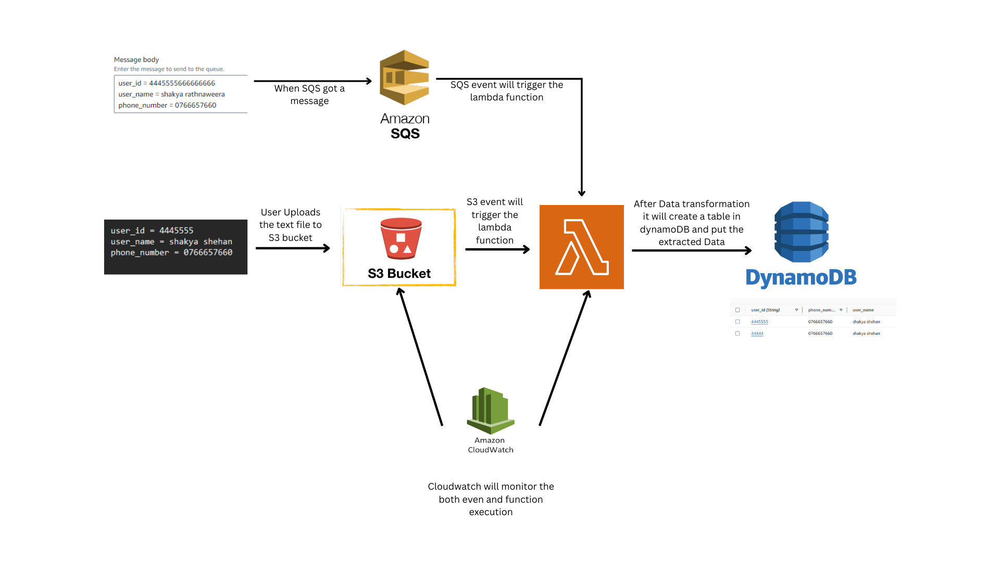

# serverless-user-management

# Serverless User Management Application

This repository contains a serverless application designed to process user data from various event sources, transform the data, and store it in an Amazon DynamoDB table. The application leverages AWS services including S3, SQS, and Lambda, and is deployed using the Serverless Framework.

## Features

- **Event Sources**: Supports data ingestion from S3 and SQS
- **Data Transformation**: Processes and transforms raw data in AWS Lambda functions.
- **Database Storage**: Stores transformed data in Amazon DynamoDB for efficient querying.
- **Monitoring and Logging**: Integrates with AWS CloudWatch for detailed logging and monitoring.
- **Security and Access Control**: Utilizes IAM roles and policies to secure access to AWS resources.

## Table of Contents

- [Architecture](#architecture)
- [Getting Started](#getting-started)
  - [Prerequisites](#prerequisites)
  - [Installation](#installation)
  - [Deployment](#deployment)
- [Usage](#usage)
  - [S3 Event](#s3-event)
  - [SQS Event](#sqs-event)
- [Monitoring and Logging](#monitoring-and-logging)
- [Security and Access Control](#security-and-access-control)
- [Contributing](#contributing)
- [License](#license)

## Architecture

The application consists of the following components:
- **Lambda Functions**: Handle data processing from S3, SQS, and Kinesis.
- **DynamoDB**: Stores the processed user data.
- **S3**: Stores incoming raw data files.
- **SQS**: Queues messages for processing.
- **CloudWatch**: Monitors and logs application performance and errors.

## Getting Started

### Prerequisites

- Node.js and npm
- Serverless Framework
- AWS CLI configured with appropriate permissions
- BFG Repo-Cleaner (optional for cleaning git history)

### Installation

1. **Clone the repository**:
   ```bash
   git clone https://github.com/ssadhikari/serverless-user-management.git
   cd serverless-user-management
   ```

2. **Install dependencies**:
   ```bash
   npm install
   ```

3. **Create a `.env` file** in the root directory and add your AWS credentials:
   ```plaintext
   AWS_ACCESS_KEY_ID=your-access-key-id
   AWS_SECRET_ACCESS_KEY=your-secret-access-key
   ```

### Deployment

1. **Deploy the application**:
   ```bash
   serverless deploy --stage dev
   ```

## Usage

### S3 Event

Upload a file to the specified S3 bucket (`shehan-user-data`). The Lambda function will process the file and store the transformed data in DynamoDB.

### SQS Event

Send a message to the SQS queue (`user-data-queue`). The Lambda function will process the message and store the transformed data in DynamoDB.

## Monitoring and Logging

The application integrates with AWS CloudWatch for monitoring and logging. CloudWatch alarms are configured to monitor the Lambda function errors and notify via SNS.

### CloudWatch Alarms Configuration

- **Alarm Name**: DataProcessorFunctionErrors
- **Namespace**: AWS/Lambda
- **Metric Name**: Errors
- **Threshold**: 1 error
- **Evaluation Periods**: 1
- **Actions**: Sends notifications to the configured SNS topic (`alarm-topic`).

## Security and Access Control

The application uses IAM roles and policies to manage permissions. The following permissions are required:

- DynamoDB access
- S3 read access
- SQS access
- CloudWatch logging

## Workflow of this application


